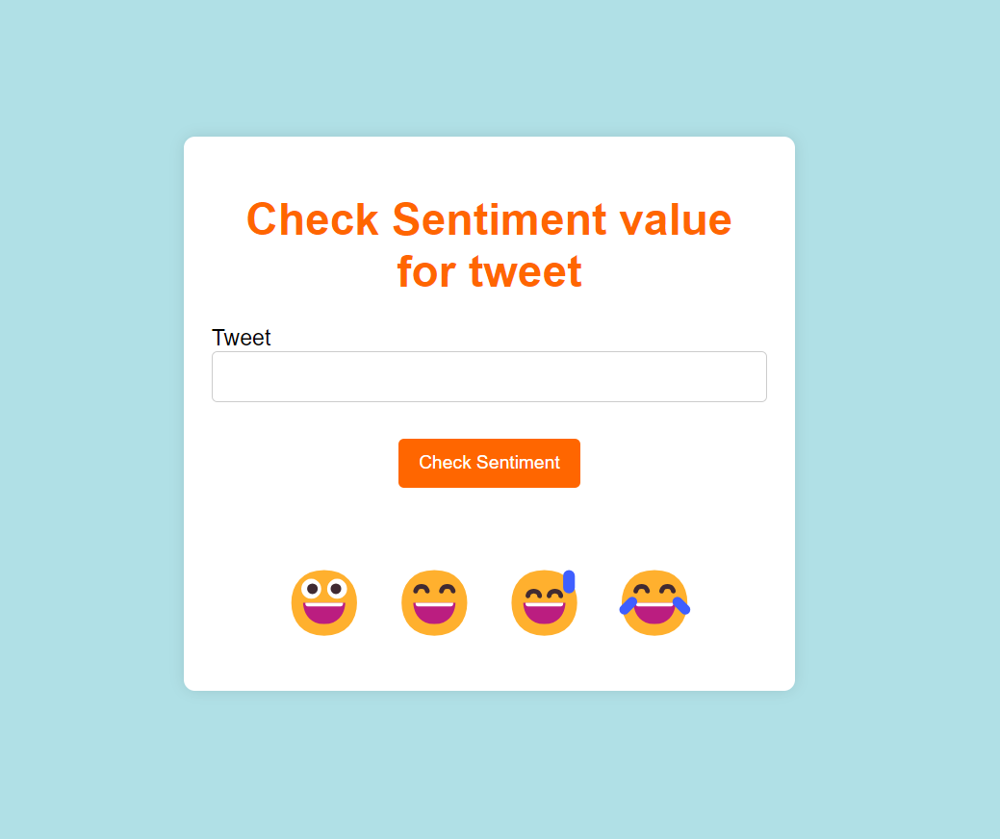

# Sentiment Analyzer Case Study

Sentiment Analyzer case study is a Machine Learning and NLP base project for sentiment analysis of social media data

DataSet: Sentiment140 - (https://www.kaggle.com/datasets/kazanova/sentiment140)

## Installation

Use the package manager [pip](https://pip.pypa.io/en/stable/) to install all dependencies.

```bash
pip install -r requirements.txt
```

## Usage of Project

Goto /sentimentanalysis directory

Run below python file to productionize Sentiment Analyzer Classifier model with flask API
```python
Python SentimentAnalyzerEngine.py
```
Run below python file to train Sentiment Analyzer Classifier model

```python
Python main.py
```

## Outputs



