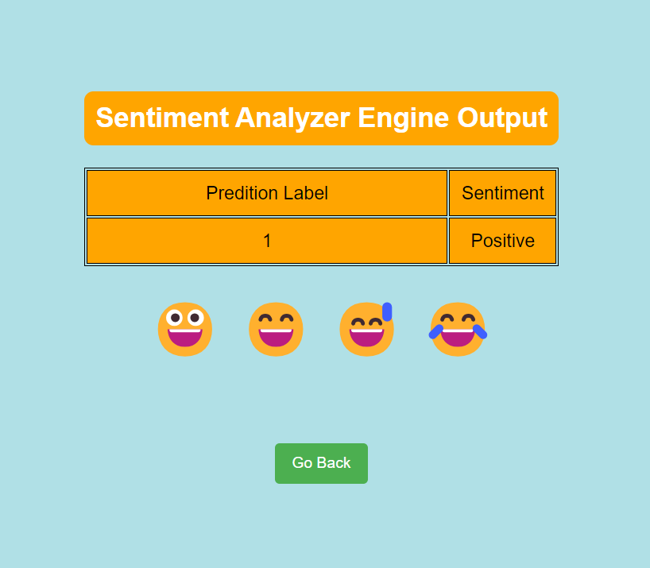

# Sentiment Analyzer Case Study

Sentiment Analyzer case study is a Machine Learning and NLP base project for sentiment analysis of social media data


## Title: Sentiment Analysis of Twitter Data with Flask

### Description:
The Sentiment Analysis of Social Media Twitter Data project utilizes machine learning techniques to analyze the sentiment of tweets collected from Twitter. This project offers a Flask web application interface where users can input a tweet, and the system will predict its sentiment as either positive or negative.

### Key Components:
**1. Data Preprocessing:** Tweets undergo preprocessing, including text cleaning, tokenization, and vectorization, to prepare them for sentiment analysis.

**2. Machine Learning Model:** A trained machine learning model, implemented using logistic regression, is employed to predict the sentiment of the input tweet.

**3. Flask Web Application:** The project is deployed as a Flask web application, providing an intuitive user interface for sentiment analysis prediction.

**4. YAML Configuration:** Configuration parameters such as model paths, vectorizer paths, and dataset paths are managed using YAML configuration files, ensuring flexibility and ease of maintenance.

The project's web application interface allows users to interactively explore the sentiment of Twitter data, making it a valuable tool for social media analysis, market research, and sentiment tracking. By leveraging machine learning and web technologies, this project offers insights into public opinion and sentiment trends on Twitter.

**DataSet:** Sentiment140 - (https://www.kaggle.com/datasets/kazanova/sentiment140)

## Installation

Use the package manager [pip](https://pip.pypa.io/en/stable/) to install all dependencies.

```bash
pip install -r requirements.txt
```

## Usage of Project

Goto /sentimentanalysis directory

Run below python file to productionize Sentiment Analyzer Classifier model with flask API
```python
Python SentimentAnalyzerEngine.py
```
Run below python file to train Sentiment Analyzer Classifier model

```python
Python main.py
```

## Outputs



